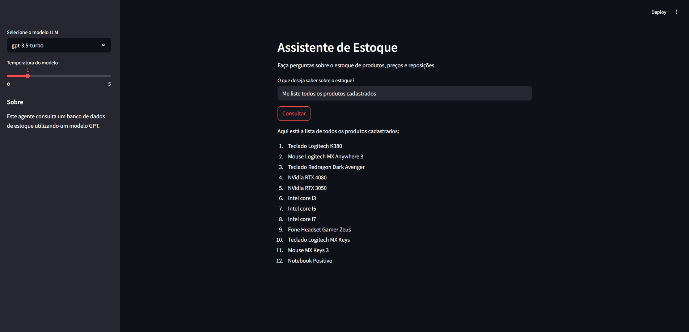

# Assistente de Estoque GPT

Este projeto é um assistente inteligente para consulta de estoque de produtos, preços e reposições, utilizando modelos de linguagem GPT integrados a um banco de dados SQLite.



## Propósito

O objetivo é fornecer uma interface amigável para que usuários possam fazer perguntas sobre o estoque e obter respostas detalhadas, utilizando inteligência artificial para interpretar e consultar os dados do banco.

## Tecnologias Utilizadas

- [Python](https://www.python.org/)
- [Streamlit](https://streamlit.io/) (interface web)
- [LangChain](https://python.langchain.com/) (orquestração de agentes LLM)
- [OpenAI GPT](https://platform.openai.com/docs/models) (modelos de linguagem)
- [SQLite](https://www.sqlite.org/index.html) (banco de dados local)
- [python-decouple](https://github.com/henriquebastos/python-decouple) (gestão de variáveis de ambiente)

## Como rodar o projeto

1. **Clone o repositório:**
   ```sh
   git clone https://github.com/thiagoalmeida37/agent-estoque.git
   cd agent-estoque
   ```

2. **Crie e ative um ambiente virtual (opcional, mas recomendado):**
   ```sh
   python -m venv venv
   source venv/bin/activate  # Linux/Mac
   venv\Scripts\activate     # Windows
   ```

3. **Instale as dependências:**
   ```sh
   pip install -r requirements.txt
   ```

4. **Configure a variável de ambiente:**
   - Renomeie o arquivo `.env.example` para `.env` e adicione sua chave da OpenAI:
     ```
     OPENAI_API_KEY='sua-chave-aqui'
     ```

5. **Certifique-se de que o arquivo `estoque.db` está presente na raiz do projeto.**

6. **Execute o aplicativo:**
   ```sh
   streamlit run main.py
   ```

7. **Acesse no navegador:**
   - O Streamlit abrirá automaticamente ou acesse [http://localhost:8501](http://localhost:8501)

## Observações

- O arquivo `estoque.db` não é versionado por padrão.
- O projeto utiliza modelos GPT da OpenAI, portanto é necessário possuir uma chave de API válida.

---

Sinta-se à vontade para contribuir ou sugerir melhorias!
